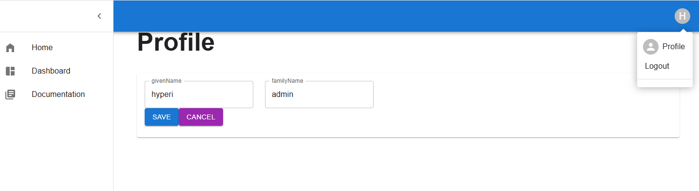

# Jwt based React login to Spring boot + Spring Security + database for users
This is just for learning purposes and sandbox for all kinds of experiments

## DemoApplication
Initializes default user so things can be tested

## Documentation page 
Testing some plugins and react data sending + spring cors

## bot emulator to mimic Teams app sending data to backend
Emulator uses this with javascript
https://learn.microsoft.com/en-us/azure/bot-service/bot-service-debug-emulator?view=azure-bot-service-4.0&tabs=javascript

#Teams like bot to send example Teams meeting summary to backend to save it as documentation.
The other Node.js based project that is linked to this: https://github.com/vulp/microsoftsbotframeworkemulator

## Charts page
Testing popular react plugins how they work with cool charts
https://recharts.org/en-US/

todo next how to change chart type on the fly

## Keycloak
Testing popular IAM
login, user updating etc

to start got to the keycloak folder and example:
.\kc.bat start-dev
or start using Docker

## Ollama AI
This sandbox uses to analyze example chart trends
https://ollama.com/library/gemma3

## Profile page
user can change some user details and UI theme

## Screenshots
Profile and some navigation
